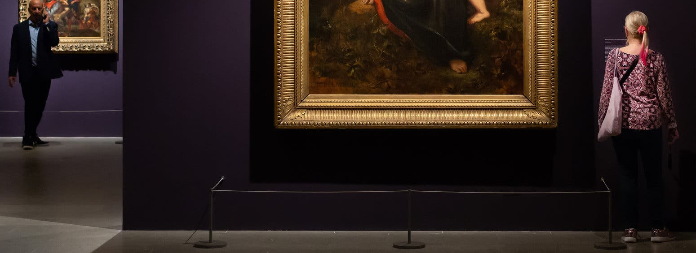
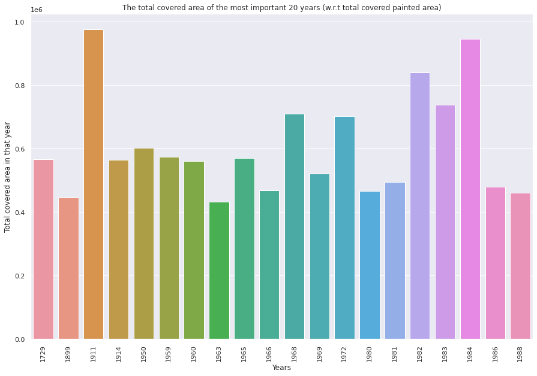
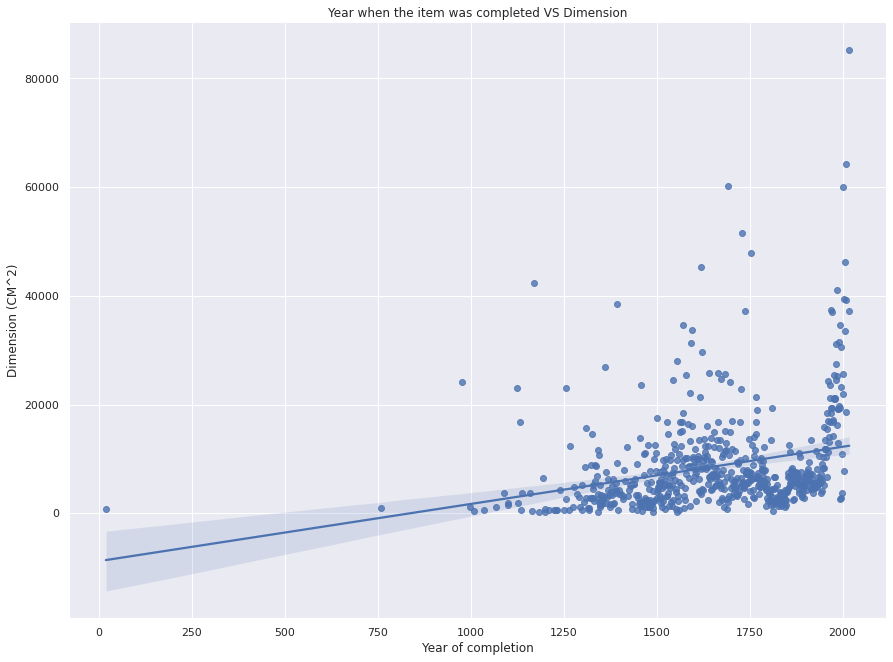

# MetMuseum Dataset 

## Findings ways of improvements of the collection of paintings and drawings in the Metropolitan Museum of Art 

The work conducted in this project was for the Data Analysis (KEN 3450) course of Maastricht University.

The main idea behind this project was to obtain a messy dataset and develop interesting insights by cleaning the data and comprehending what procedures are viable in the resultant context.

The project proposal had first to be submitted and accepted, and the final project should contain:
- Data acquisition (scraping, API, other,...) and cleanup
- EDA
- Analysis method(s) (regression, classification, DR,...)
- 1 task is enough but compare at least two algorithms 
- Ethical considerations

The dataset used in this work was retrieved from https://metmuseum.github.io. and it is known to be one of the messiest datasets available to the public

---

### A few interesting insights that were obtained using the dataset:

#### - The American painters being showcased at the Met Museum lived way longer than the average American citizen between 1800 and mid-1900

#### - The American painters being showcased at the Met Museum lived way longer than the average American citizen between 1800 and mid-1900

#### - There is a slight increasing trend in the average dimensions of paintings. Therefore, in theory, such a model could be helpful to the museum if it wishes to extend an existing wing or even build a new one to make sure there is enough room for the artwork to be collected in the coming years.

